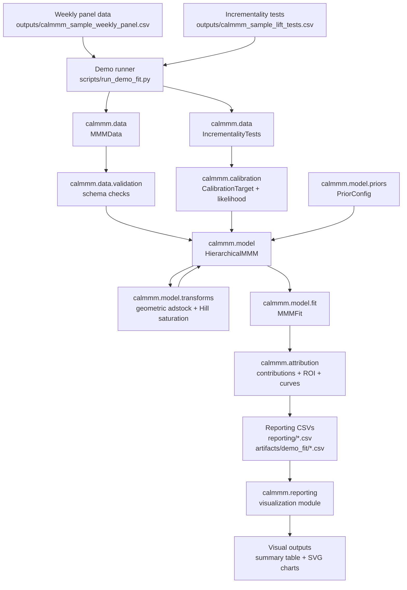
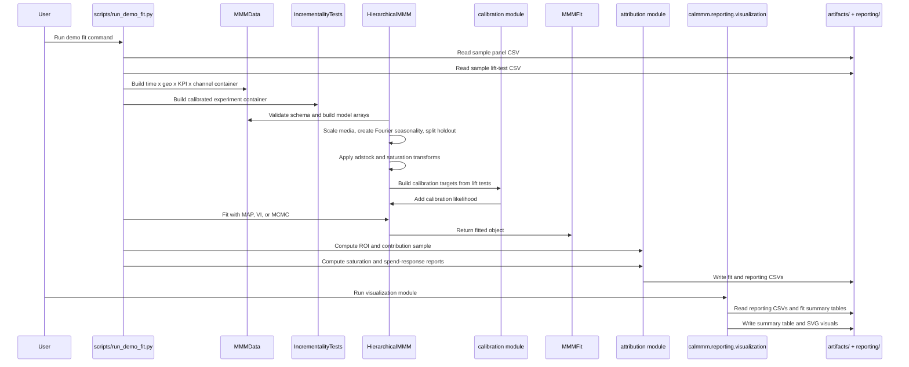
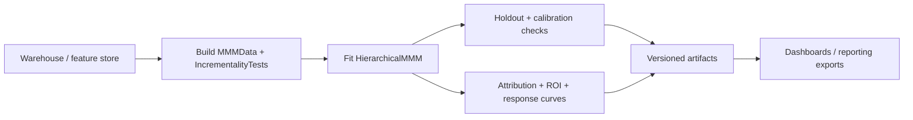

# calmmm End-to-End Workflow

This document shows how the demo and production package components connect from raw weekly marketing data through model fitting, calibration, attribution, and reporting visuals.

## Component Flow



## Runtime Sequence



## Component Responsibilities

| Component | Primary responsibility | Inputs | Outputs |
|---|---|---|---|
| `scripts/run_demo_fit.py` | Orchestrates the demo fit from sample data to CSV outputs. | Sample panel, sample lift tests, fit arguments. | `artifacts/demo_fit/*`, `reporting/*.csv`. |
| `calmmm.data.MMMData` | Normalizes wide or long marketing data into validated model containers. | Time, geo, KPI, media, spend, exposure, control, population columns. | Model-ready observations, media, controls, and KPI metadata. |
| `calmmm.data.IncrementalityTests` | Normalizes lift experiment rows and validates them against the MMM data. | Channel, KPI, geo scope, date window, lift, standard error. | Experiment container used for calibration. |
| `calmmm.model.HierarchicalMMM` | Builds and fits the Bayesian MMM. | `MMMData`, optional `IncrementalityTests`, priors, inference settings. | `MMMFit` with trace or MAP parameters. |
| `calmmm.model.transforms` | Applies differentiable media transformations inside the PyMC graph. | Scaled media spend and channel parameters. | Adstocked and saturated media tensors. |
| `calmmm.calibration` | Converts lift tests into model targets and adds calibration likelihood terms. | Experiment container, training mask, model contribution tensors. | Calibration likelihood and model-vs-observed lift table. |
| `calmmm.attribution` | Converts a fitted model into business-facing measurement outputs. | `MMMFit`. | Channel contributions, marginal contributions, ROI, saturation curves, spend response. |
| `calmmm.reporting.visualization` | Renders report tables and curves independently from the fit script. | Existing CSV outputs in `reporting/` and `artifacts/demo_fit/`. | `summary_table.csv` and SVG report charts. |

## Demo Commands

Run the fit and write raw report tables:

```bash
PYTENSOR_FLAGS='cxx=' uv run python scripts/run_demo_fit.py
```

Render the visuals from the generated report tables:

```bash
PYTENSOR_FLAGS='cxx=' uv run python -m calmmm.reporting.visualization
```

Expected output files:

```text
artifacts/demo_fit/
  calibration_fit.csv
  channel_contributions_sample.csv
  fit_quality.csv
  fit_summary.json
  mcmc_diagnostics.csv
  roi.csv

reporting/
  calibration_fit.svg
  roi.svg
  saturation_curves.csv
  saturation_curves.svg
  spend_response.csv
  spend_response.svg
  summary_table.csv
```

## Production Adaptation

The demo runner is intentionally thin: it reads local CSVs, constructs package objects, fits once, and writes local artifacts. A production workflow should keep the same component boundaries but replace the outer orchestration with a scheduled job:



Keep fitting, attribution, and visualization as separate steps so model outputs can be audited before business-facing reports are published.
