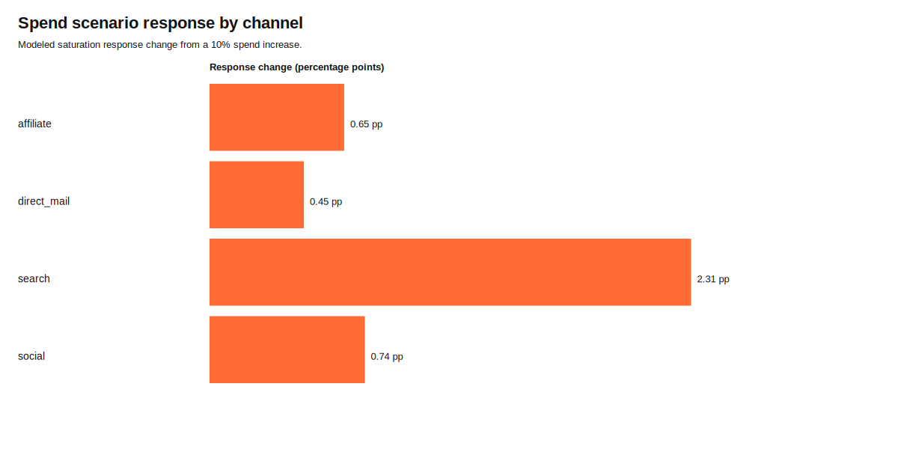
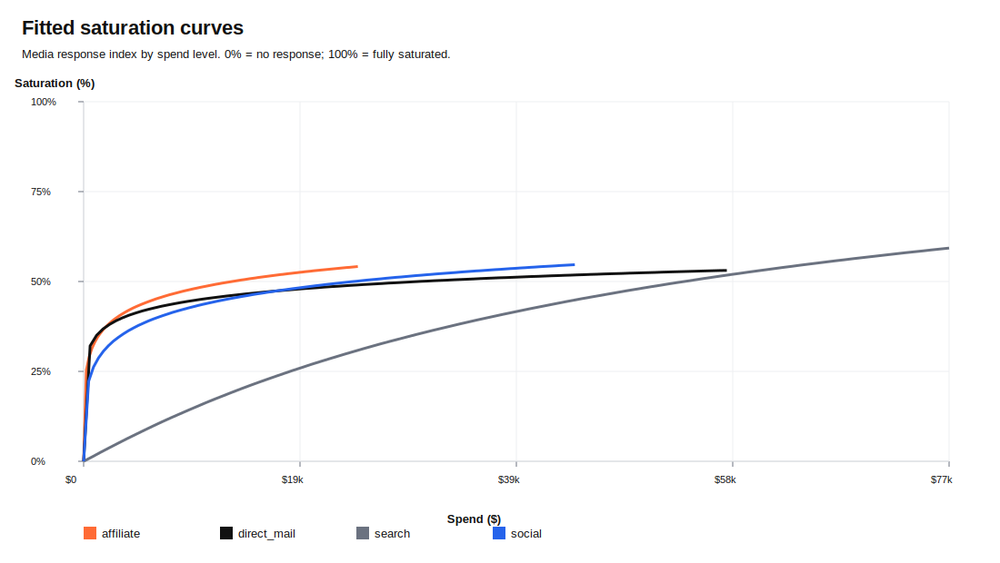
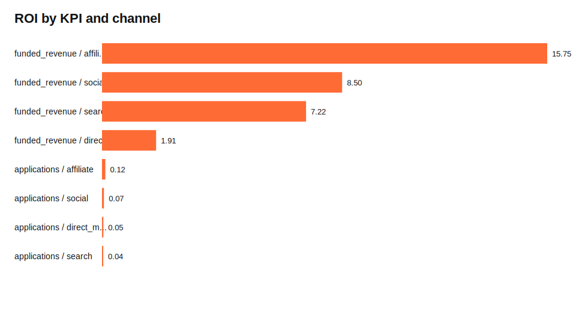
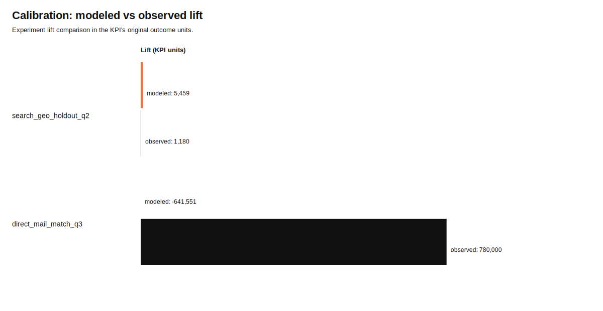

# calmmm User Guide

## Overview

`calmmm` fits a Calibrated Hierarchical Bayesian MMM. The model estimates the contribution of each media channel to each business outcome (KPI), pooling information across geographies. Optionally, lift measurements from geo experiments constrain channel contributions to reduce bias from confounding.

For a diagrammed view of how data preparation, fitting, attribution, and reporting connect, see the [End-to-End Workflow](END_TO_END_WORKFLOW.md).

---

## 1. Preparing your data

### Wide-format input

`MMMData.from_dataframe` accepts a wide DataFrame — one row per time period × geography.

```python
import pandas as pd
from calmmm import MMMData

df = pd.read_csv("weekly_data.csv")
# Expected columns (example):
#   week, region, revenue, orders, tv_spend, search_spend,
#   social_spend, tv_impressions, search_clicks, population

data = MMMData.from_dataframe(
    df,
    time="week",               # date column (parsed with pd.to_datetime)
    geo="region",              # geography column
    kpis=["revenue", "orders"],
    media=["tv", "search", "social"],           # channel names (arbitrary)
    spend=["tv_spend", "search_spend", "social_spend"],  # must align with media
    exposure=["tv_impressions", "search_clicks", None],  # None per channel = not tracked for that channel
    controls=["promo_flag", "price_index"],  # optional; added as linear baseline adjustment per KPI
    population="population",   # optional; required for binomial KPIs
    kpi_likelihoods={
        "revenue": "gaussian",
        "orders":  "negative_binomial",
    },
)
```

#### Supported likelihoods

| String | Use for |
|---|---|
| `gaussian` | continuous outcomes (revenue, GMV) |
| `lognormal` | right-skewed continuous outcomes |
| `negative_binomial` | count outcomes with overdispersion |
| `binomial` | conversion rates (requires `population`) |

Default likelihood is `negative_binomial` when `kpi_likelihoods` is omitted.

### Long-format construction

If your data is already in long format, build the four DataFrames directly:

```python
from calmmm import MMMData

data = MMMData(
    observations=obs_df,    # time, geo, kpi, outcome, population
    media=media_df,         # time, geo, channel, spend, exposure
    controls=controls_df,   # time, geo, control, value
    kpi_metadata=meta_df,   # kpi, likelihood, funnel_stage, family
)
```

### Inspecting the dataset

```python
print(data.n_times, data.n_geos, data.n_channels, data.n_kpis)
print(data.channels)  # sorted list of channel names
print(data.kpis)      # sorted list of KPI names
print(data.start_date, data.end_date)
```

---

## 2. Configuring priors

`PriorConfig` centralises all prior hyperparameters. The defaults are sensible starting points for weekly media spend data scaled to unit range.

```python
from calmmm.model.priors import PriorConfig

priors = PriorConfig(
    # Geometric adstock decay: Beta(alpha, beta), mean ≈ alpha/(alpha+beta)
    adstock_decay_alpha=3.0,   # prior mean ≈ 0.5 (symmetric)
    adstock_decay_beta=3.0,

    # Hill saturation shape (HalfNormal)
    hill_alpha_sigma=0.5,
    hill_k_sigma=1.0,

    # Baseline intercept spread on log scale
    baseline_sigma=2.0,
    seasonality_sigma=0.5,

    # Three-level media hierarchy (non-centered)
    channel_scale_global_sigma=1.0,
    channel_scale_kpi_sigma=0.5,
    channel_scale_geo_sigma=0.25,

    # Observation noise / overdispersion
    sigma_sigma=0.5,    # Gaussian / log-normal
    nb_alpha_sigma=1.0, # negative binomial alpha
)
```

Pass `priors` to `HierarchicalMMM`:

```python
from calmmm import HierarchicalMMM

mmm = HierarchicalMMM(
    priors=priors,
    n_fourier_pairs=2,       # seasonal Fourier basis pairs (period = 52 weeks)
    holdout_fraction=0.2,    # last 20 % of time steps held out for eval
)
```

---

## 3. Fitting the model

### MAP (fast — for exploration and calibration checks)

```python
fit = mmm.fit(data, mode="map")
# fit.map_params  → dict of parameter name → numpy array
```

### MCMC (full posterior — recommended for production)

```python
fit = mmm.fit(
    data,
    mode="sample",
    draws=1000,
    tune=1000,
    target_accept=0.9,
    chains=4,
)
# fit.trace  → arviz InferenceData
```

### Variational Inference (moderate speed/quality tradeoff)

```python
fit = mmm.fit(
    data,
    mode="vi",
    n=30000,      # ADVI iterations
)
# fit.trace  → arviz InferenceData (200 posterior samples)
```

---

## 4. Calibration with lift experiments

Lift measurements from geo holdout or geo matched-market tests constrain channel contributions during fitting.

### Building an IncrementalityTests object

```python
from calmmm import IncrementalityTests

exps = IncrementalityTests.from_dataframe(
    experiments_df,
    channel="channel",
    kpi="kpi",
    geo_scope="geos",       # comma-separated geo list per experiment
    start="start_date",
    end="end_date",
    lift="lift_value",
    standard_error="se",    # provide se OR ci_lower+ci_upper
    # ci_lower="ci_lo",
    # ci_upper="ci_hi",
    calibration_likelihood="normal",   # "normal" or "student_t"
    student_t_nu=5.0,
    estimand="total",
    mmmdata=data,           # optional: validates channels/geos/dates against dataset
)
```

### Fitting with calibration

```python
fit = mmm.fit(data, experiments=exps, mode="map")
# or mode="sample" for full posterior
```

### Inspecting calibration targets

```python
from calmmm.calibration.lift import compute_model_lift

lift_df = compute_model_lift(fit, fit.calibration_targets)
# columns: test_id, lift_model, lift_obs, se, z_score
print(lift_df)
```

A `z_score` near zero means the model lift matches the observed experiment lift. Large z-scores indicate tension between the model and the experiment data.

---

## 5. Attribution

### Channel contributions (additive decomposition)

Returns a decomposition that sums to the total outcome for every time × geo × KPI cell.
Baseline = the outcome that would remain with no media spend.
Each channel gets a proportional share of the total media increment.

```python
from calmmm.attribution.contributions import channel_contributions

contribs = channel_contributions(fit)
# DataFrame: time, geo, kpi, channel, contribution
# channel is one of the model's channel names, or "baseline"
# baseline + all channel contributions = exp(mu) for every (t, g, k) — additive by construction
```

> **Why proportional, not marginal?**  Under a log-linear model there is no unique additive
> decomposition in outcome space.  `channel_contributions()` uses a hybrid convention:
> baseline = exp(mu − Σcc); each channel's share is proportional to its log-scale coefficient.
> This is additive and interpretable for pie charts / waterfall displays.

### Marginal (counterfactual) contributions

How much outcome is lost if each channel is removed entirely — the correct input for iROAS and budget optimisation.  These values do **not** sum to the total outcome.

```python
from calmmm.attribution.contributions import marginal_contributions

marginals = marginal_contributions(fit)
# DataFrame: time, geo, kpi, channel, contribution
# No "baseline" row — use channel_contributions() for that
```

### ROI

ROI is computed from marginal contributions (the economically meaningful denominator):

```python
from calmmm.attribution.roi import compute_roi

roi = compute_roi(fit)
# DataFrame: kpi, channel, total_contribution, total_spend, roi
```

### Saturation curves

```python
from calmmm.attribution.curves import saturation_curve

curve = saturation_curve(fit, channel="tv", n_points=100)
# DataFrame: spend, saturation, channel
# spend is in original units; saturation in [0, 1]
```

---

## 6. Reporting visuals

The demo workflow writes CSV report tables first, then renders SVG charts from those tables. This keeps the fit outputs reviewable before the visual layer is generated.

```bash
PYTENSOR_FLAGS='cxx=' uv run python scripts/run_demo_fit.py
PYTENSOR_FLAGS='cxx=' uv run python -m calmmm.reporting.visualization
```

### Spend response

Shows the modeled saturation response change, in percentage points, from the configured spend scenario. In the demo output the scenario is a 10% spend increase for each channel.



### Saturation curves

Shows the fitted media response index by spend level. The y-axis is the saturation index: 0% means no modeled media response, and 100% means fully saturated response for that channel curve.



### ROI

Shows modeled marginal contribution per $1 of spend for each KPI and channel. ROI is computed from marginal counterfactual contributions, not the additive attribution table.



### Calibration fit

Compares model-implied lift against observed lift tests in the KPI's original outcome units. Large gaps or large absolute z-scores indicate tension between the fitted MMM and the experiment evidence.



---

## 7. Model evaluation

### Holdout RMSE

```python
metrics = fit.holdout_metrics()
# dict: rmse_{kpi} for each KPI
# e.g. {"rmse_revenue": 12450.3, "rmse_orders": 87.2}
```

The holdout window is the last `holdout_fraction` of time steps, excluded from the likelihood during fitting.

### Posterior predictive (MCMC / VI only)

```python
ppc = fit.posterior_predictive()
# dict: obs_{kpi} → ndarray [samples, T_train, G]
```

Use this for visual posterior predictive checks — plot the training data against the 90th percentile posterior band.

---

## 8. MCMC diagnostics

For MCMC fits, use ArviZ directly on `fit.trace`:

```python
import arviz as az

az.plot_trace(fit.trace, var_names=["adstock_decay", "hill_alpha", "hill_k"])
az.summary(fit.trace, var_names=["adstock_decay"])
# Check r_hat < 1.01 and ess_bulk > 400
```

---

## 9. End-to-end example

```python
import pandas as pd
from calmmm import MMMData, HierarchicalMMM, IncrementalityTests
from calmmm.attribution.contributions import channel_contributions
from calmmm.attribution.roi import compute_roi
from calmmm.calibration.lift import compute_model_lift

# --- Data ---
df = pd.read_csv("weekly_data.csv")
data = MMMData.from_dataframe(
    df, time="week", geo="region",
    kpis=["revenue"], media=["tv", "search", "social"],
    spend=["tv_spend", "search_spend", "social_spend"],
    kpi_likelihoods={"revenue": "gaussian"},
)

# --- Experiments ---
exps = IncrementalityTests.from_dataframe(
    pd.read_csv("experiments.csv"),
    channel="channel", kpi="kpi", geo_scope="geos",
    start="start", end="end", lift="lift", standard_error="se",
    mmmdata=data,
)

# --- Fit ---
mmm = HierarchicalMMM(holdout_fraction=0.2)
fit = mmm.fit(data, experiments=exps, mode="sample", draws=1000, tune=1000, chains=4)

# --- Evaluate ---
print(fit.holdout_metrics())
print(compute_model_lift(fit, fit.calibration_targets))

# --- Attribution ---
print(compute_roi(fit))
```
