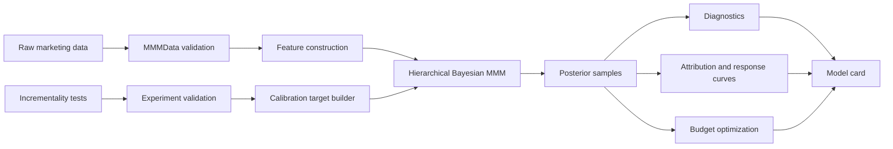
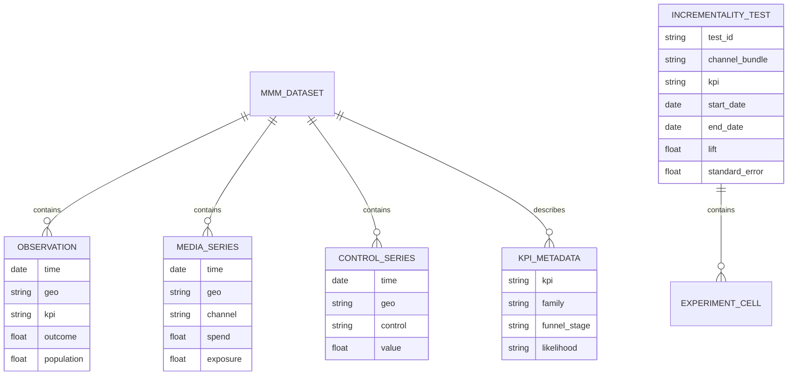
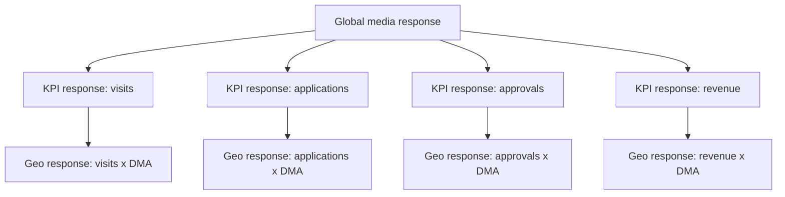
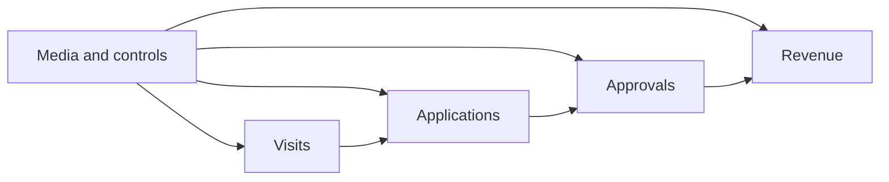
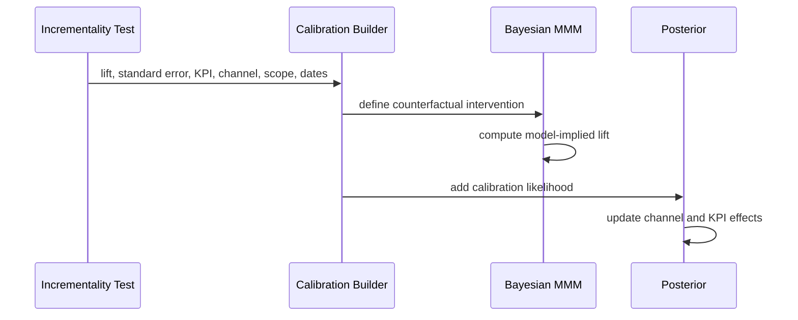

# Bayesian Nonparametric Multi-KPI MMM Design Spec

Date: 2026-06-15
Status: Draft for review
Audience: Marketing science, data science, analytics engineering, and production ML teams

## Summary

This package is a production-oriented marketing analytics library for calibrated Bayesian Marketing Mix Modeling. It combines geo-level hierarchy, native multi-KPI modeling, flexible nonparametric response functions, and formal incrementality-test calibration.

The design target is not another single-KPI MMM notebook. The package should support repeatable, governed workflows where observational panel data, experiments, diagnostics, attribution, and budget optimization all share one consistent probabilistic model.

Core positioning:

> Meridian-style geo hierarchy plus Robyn-style incrementality calibration, extended to native multi-KPI production analytics.

## Goals

- Fit hierarchical MMMs over `time x geo x KPI` panels.
- Model multiple KPIs jointly, including optional funnel structure.
- Use Bayesian nonparametric components for baselines, seasonality, and media response curves.
- Calibrate the model with incrementality experiments as likelihood terms.
- Produce decision-grade posterior outputs: contribution, ROI, marginal ROI, response curves, uncertainty intervals, calibration residuals, and budget recommendations.
- Provide production APIs for schema validation, reproducible fitting, diagnostics, model cards, and report generation.

## Non-Goals

- Reimplement Robyn's full multi-objective evolutionary model search.
- Reimplement Meridian's exact TensorFlow Probability model.
- Build a dashboard in the first package version.
- Support every possible causal experiment design in v1.
- Make funnel KPIs deterministic conversion-rate chains. Funnel structure should inform pooling and dependencies without forcing business processes into rigid arithmetic.

## Primary Comparison Points

### Robyn

Robyn is strongest as an automated single-KPI MMM workflow with calibration targets used in model selection. This package should differ by making calibration a probabilistic part of fitting:

```text
experiment_estimate ~ Normal(model_implied_lift, experiment_standard_error)
```

This preserves experiment uncertainty and lets calibration affect the full posterior, not only final model ranking.

### Meridian

Meridian is strongest as a Bayesian geo-level MMM with partial pooling and strong production-quality guidance. This package should keep the geo hierarchy idea, then extend it to joint KPI modeling:

```text
time x geo x channel -> multiple KPIs -> calibrated posterior decisions
```

The main differentiator is first-class `geo x KPI` hierarchy with optional funnel dependencies.

## User Workflow

```python
from calmmm import MMMData, IncrementalityTests, HierarchicalMMM

dataset = MMMData.from_dataframe(
    df,
    time="week",
    geo="dma",
    kpis=["visits", "applications", "approvals", "revenue"],
    media=["search", "social", "tv", "display"],
    spend=["search_spend", "social_spend", "tv_spend", "display_spend"],
    controls=["seasonality", "price", "macro_index"],
)

experiments = IncrementalityTests.from_dataframe(
    lift_df,
    channel="channel",
    kpi="kpi",
    geo_scope="geo",
    start="start_date",
    end="end_date",
    lift="incremental_outcome",
    standard_error="se",
)

model = HierarchicalMMM(
    hierarchy=["geo", "kpi"],
    kpi_structure="funnel",
    calibration="experiment_likelihood",
)

fit = model.fit(dataset, experiments=experiments)
report = fit.report()
budget_plan = fit.optimize_budget()
```

## System Architecture



Package modules:

- `calmmm.data`: canonical data containers, schema validation, panel balancing, missingness checks.
- `calmmm.transforms`: adstock, lag kernels, saturation curves, seasonality, scaling.
- `calmmm.model`: model specifications and inference adapters.
- `calmmm.calibration`: experiment schemas, estimands, model-implied lift calculations, calibration likelihood.
- `calmmm.diagnostics`: convergence checks, posterior predictive checks, calibration residuals, holdout metrics.
- `calmmm.attribution`: contributions, ROI, marginal ROI, channel decompositions, KPI decompositions.
- `calmmm.optimization`: constrained budget optimization under posterior uncertainty.
- `calmmm.reporting`: model cards, HTML reports, comparison tables.
- `calmmm.benchmarks`: Robyn-style and Meridian-style example workflows.

## Core Data Model

The canonical observational dataset is a panel:

```text
time, geo, kpi, outcome, channel metrics, channel spend, controls, population/exposure
```

The library should accept wide user data and convert it to a normalized internal representation.



## Hierarchies

### V1 Required: Geo x KPI Hierarchy

The first supported hierarchy is:

```text
global channel effect
  -> KPI-specific channel effect
    -> geo-specific KPI-channel effect
```

This gives stable estimates for sparse geos while preserving local variation.



### V1 Optional: Funnel KPI Structure

Funnel structure should be declarative:

```yaml
kpi_structure:
  type: funnel
  stages:
    - visits
    - applications
    - approvals
    - revenue
```

The model can use upstream KPI latent states as predictors for downstream KPIs, while each KPI keeps its own media response.



### Later: Business-Unit Hierarchy

After the `geo x KPI` foundation is stable, add optional pooling over product, brand, segment, or region:

```text
global -> business unit -> KPI -> geo
```

This should be deferred until the first hierarchy has strong diagnostics and examples.

## Model Specification

For observation `y[t, g, k]`:

```text
y[t, g, k] ~ Likelihood(mu[t, g, k], dispersion[k])

mu[t, g, k] =
    baseline[t, g, k]
  + controls[t, g] * beta_controls[k, g]
  + sum_channels response[channel, t, g, k]
  + optional_funnel_terms[t, g, k]
```

### Likelihood Families

Supported KPI likelihoods:

- Gaussian for revenue, margin, or transformed continuous outcomes.
- Lognormal for positive skewed revenue.
- Negative binomial for counts such as leads, applications, approvals.
- Bernoulli or binomial for rates when denominator data is available.

The default should be conservative:

- Revenue-like KPI: lognormal or Gaussian on transformed scale.
- Count KPI: negative binomial.
- Rate KPI: binomial with explicit denominator required.

## Nonparametric Components

The package is Bayesian nonparametric where fixed parametric shape is most likely to bias business decisions.

### Baseline

Baseline options:

- Dynamic local trend for production default.
- Gaussian process for smaller datasets.
- Penalized spline for scalable approximation.

Default: dynamic trend plus seasonal Fourier terms.

### Media Carryover

Adstock should support:

- Geometric adstock for simple stable production use.
- Weibull lag kernels for flexible carryover.
- Optional discrete lag kernel with shrinkage for nonparametric carryover.

Default: Weibull lag kernel with regularizing priors.

### Media Saturation

Response curves should support:

- Hill curves for interpretable MMM comparison.
- Monotone splines for flexible nonparametric response.

Default v1: monotone I-spline response with shrinkage and optional Hill-compatible summary metrics.


## Incrementality Calibration

Incrementality tests enter as observed causal estimates with uncertainty.

Each experiment must define:

- `test_id`
- tested channel or channel bundle
- KPI measured
- geo scope or national scope
- time window
- spend or exposure intervention
- lift estimate
- standard error or confidence interval
- estimand type: immediate, carryover, total, cumulative

Calibration likelihood:

```text
lift_hat[e] ~ Normal(lift_model[e], se[e])
```

Where `lift_model[e]` is calculated by simulating the model under:

- observed media in the experiment period, and
- counterfactual media with the tested intervention removed or adjusted.



Calibration diagnostics:

- Calibration residual by experiment.
- Posterior probability that model-implied lift is within experiment interval.
- Influence score showing how much each experiment changes posterior ROI.
- Conflict warnings when experiments and observational data disagree materially.

## Inference Strategy

The package should separate model specification from inference backend.

Initial backend recommendation:

- PyMC for model clarity, diagnostics, and Python ecosystem fit.
- NumPyro or JAX backend later for larger panels and faster sampling.

Required fit modes:

- `sample`: full MCMC for final decision models.
- `vi`: variational inference for fast iteration.
- `map`: optimization-only warm start and debugging mode.

Production defaults:

- Start with VI or MAP for shape/debug checks.
- Require MCMC or validated approximation before final reports and budget optimization.

## Diagnostics and Guardrails

A fit object should not silently produce decision outputs if core diagnostics fail.

Required diagnostics:

- R-hat and effective sample size for MCMC.
- Divergence count and tree depth warnings.
- Posterior predictive checks by KPI and geo.
- Holdout performance by KPI.
- Calibration residuals by experiment.
- Prior-to-posterior movement for media ROI.
- Contribution sanity checks: non-negative media effects by default, plausible baseline share, no impossible KPI totals.

Decision outputs should carry a `diagnostics_status`:

```text
pass | warn | fail
```

Budget optimization should require `pass` or explicit user override.

## Attribution and Decision Outputs

The fit object should produce:

- KPI-level contribution by channel.
- Geo-level contribution by channel.
- Funnel-stage contribution by channel.
- ROI and marginal ROI distributions.
- Response curves with uncertainty.
- Saturation diagnostics.
- Experiment fit table.
- Scenario forecasts.
- Budget allocation recommendations.

Optimization should be posterior-aware:

```text
maximize expected KPI subject to budget, channel bounds, geo bounds, and risk constraints
```

Risk-aware objectives:

- maximize expected return,
- maximize lower credible bound,
- minimize probability of underperforming current plan,
- meet KPI targets under uncertainty.

## Reporting

Reports should be designed for production review, not notebook-only exploration.

Report sections:

- Data quality summary.
- Model configuration.
- Diagnostics status.
- KPI fit summary.
- Calibration fit summary.
- Channel contribution.
- ROI and marginal ROI.
- Response curves.
- Budget recommendations.
- Known limitations and warnings.

Model card fields:

- package version,
- fit timestamp,
- data date range,
- model spec hash,
- experiment IDs used,
- diagnostics status,
- approved decision uses,
- disallowed decision uses.

## Error Handling

Validation should fail early for:

- missing required columns,
- duplicate panel rows,
- inconsistent KPI metadata,
- experiments referencing unknown KPIs or channels,
- experiment windows outside the observed data range,
- missing standard errors for calibration,
- negative spend where not explicitly allowed,
- rate KPIs without denominators.

Warnings should be emitted for:

- sparse geos,
- weak media variation,
- high media collinearity,
- uncalibrated high-spend channels,
- experiments that conflict strongly with observational signal.

## Testing Strategy

Test layers:

1. Unit tests for schema validation and transforms.
2. Simulation tests where true media effects are known.
3. Calibration tests where synthetic experiments pull posterior estimates toward known lift.
4. Hierarchy tests where sparse geos borrow strength from pooled priors.
5. API tests for stable user workflows.
6. Report snapshot tests for expected sections and warning behavior.

Minimum acceptance examples:

- Single KPI, national model fits a small synthetic dataset.
- Multi-KPI geo model fits synthetic `visits -> applications -> revenue`.
- Calibration experiment changes posterior ROI in the expected direction.
- Diagnostics fail when experiment data conflicts with model-implied lift beyond tolerance.
- Budget optimizer refuses to run on failed diagnostics unless explicitly overridden.

## Documentation Plan

Documentation should include:

- Quickstart: calibrated multi-KPI MMM in 20 lines.
- Data schema guide.
- Incrementality calibration guide.
- Hierarchy guide: national, geo, KPI, funnel.
- Robyn comparison guide.
- Meridian comparison guide.
- Diagnostics guide.
- Budget optimization guide.
- Production model governance guide.

## MVP Scope

V1 should ship:

- Python package skeleton.
- `MMMData` and `IncrementalityTests` containers.
- Wide-to-long data normalization.
- Geo x KPI hierarchy.
- Dynamic baseline.
- Weibull adstock.
- Monotone saturation response.
- Negative binomial and Gaussian/lognormal likelihoods.
- Experiment calibration likelihood.
- MCMC fit mode.
- Basic VI or MAP debug mode.
- Core diagnostics.
- Attribution and response curves.
- Basic constrained budget optimizer.
- HTML or Markdown report.
- Synthetic examples and tests.

## Deferred Scope

Defer until after MVP:

- Full dashboard.
- Automated model search comparable to Robyn.
- Exact Meridian-compatible data import/export.
- Multi-business-unit hierarchy.
- Advanced causal designs beyond aggregate lift tests.
- Real-time or streaming MMM updates.
- Distributed inference.

## Open Design Decisions

These should be resolved before implementation planning:

1. Package name: use `calmmm` as the working implementation name; final distribution branding can be changed before publishing.
2. Inference backend: PyMC first, or NumPyro first.
3. Whether to require all KPIs in one long table internally.
4. Whether v1 budget optimization should optimize one primary KPI or weighted multi-KPI utility.
5. Whether funnel dependencies are enabled in MVP or treated as beta.

## Acceptance Criteria

The design is ready for implementation planning when:

- The MVP scope is accepted.
- The package name is chosen.
- The first inference backend is chosen.
- The primary optimization target behavior is chosen.
- The calibration experiment schema is accepted.

---

## Appendix A — Calibration Walkthrough

This appendix traces a single incrementality experiment through every calibration step to make the mechanics concrete.

### Example experiment

A Search channel geo-holdout ran for 4 weeks across 10 DMAs measuring `visits`.

| Field | Value |
|---|---|
| `test_id` | `search_geo_holdout_q1` |
| `channel` | `search` |
| `kpi` | `visits` |
| `geo_scope` | 10 treatment DMAs |
| `dates` | 2026-01-05 to 2026-02-01 |
| `lift` | 12,000 incremental visits |
| `standard_error` | 2,500 |
| `estimand` | `total` (includes carryover) |

### Step 1 — Schema validation

`IncrementalityTests` checks that `search` exists in `MMMData`, `visits` exists in `MMMData`, the date window falls within the observed panel, and `se` is present. Failure here is an early hard error, not silent bad math downstream.

### Step 2 — Define the counterfactual

The calibration builder constructs a counterfactual panel: identical to observed data, except `search_spend[t, g] = 0` for `t` in the experiment window and `g` in the 10 treatment DMAs.

### Step 3 — Compute model-implied lift

Under each parameter draw the model predicts outcomes twice:

```text
y_observed[t, g, visits]        # prediction with actual search spend
y_counterfactual[t, g, visits]  # prediction with search zeroed out

lift_model[e] = sum over (t, g) of (y_observed - y_counterfactual)
```

If the current draw has search over-attributed, `lift_model[e]` might be 25,000. If under-attributed, it might be 4,000.

### Step 4 — Apply the calibration likelihood

The experiment measurement enters as an observation:

```text
12,000 ~ Normal(lift_model[e], 2,500)
```

A draw where `lift_model[e] = 25,000` has near-zero likelihood of producing 12,000 with `sd = 2,500` and is heavily penalized. A draw where `lift_model[e] = 11,000` has high likelihood and is favored. MCMC upweights consistent draws and discards inconsistent ones.

### Step 5 — Posterior cascade

Because the calibration likelihood is part of the joint model, its effect propagates:

- Search ROI posterior shifts toward the experimental estimate.
- Baseline absorbs the share that was incorrectly attributed to search.
- Other channels shift as the total must sum to observed visits.
- Downstream funnel KPIs (applications, approvals) adjust because visits feeds them.

This differs from Robyn's calibration, which is a post-hoc model-selection filter. Here, calibration reshapes the posterior of every parameter simultaneously.

### Step 6 — Calibration diagnostics

After fitting the model reports:

```text
residual[e] = lift_experiment[e] - posterior_mean(lift_model[e])
            = 12,000 - ~12,400     # should be small
```

Diagnostics surfaced per experiment:

- **Calibration residual** — internal consistency between model and experiment.
- **Posterior coverage probability** — probability that model-implied lift falls within the experiment confidence interval.
- **Influence score** — how much this experiment shifted the Search ROI posterior. A very high score paired with a conflict warning indicates the observational data and the experiment fundamentally disagree and the data or design should be investigated.

---

## Appendix B — Calibration Likelihood Distribution Choice

### Why Normal is the default

The calibration likelihood treats the experiment's reported estimate as a sufficient statistic. The Normal is appropriate because:

1. **The CLT applies.** Aggregate lift estimates from geo holdouts and switchback tests are differences of averages over many units, so they converge to normality regardless of the underlying KPI distribution.
2. **Consistency with how `se` is computed.** Most experiment frameworks (t-tests, OLS difference-in-differences, regression) compute `se` under a normality assumption. Using Normal in the calibration likelihood is internally consistent with that.
3. **Experiment size.** With 30 or more geos or thousands of users per cell the normal approximation is tight.

### When Normal breaks down

| Situation | Problem |
|---|---|
| Few geos (3–5 DMAs) | CLT has not kicked in; the true sampling distribution is heavier-tailed |
| Outlier DMAs with volatile revenue | One bad geo inflates `se` but the estimate is not symmetric |
| Lift bounded below zero | Normal assigns probability to impossible negative-lift values for channels with confirmed positive effects |
| Poorly estimated `se` | The point estimate is credible but the variance estimate is not |

### Alternative distributions

**Student-t (recommended upgrade)**

```text
lift_hat[e] ~ StudentT(nu, lift_model[e], se[e])
```

Nests Normal as `nu → ∞`. With `nu ≈ 4–7` the heavier tails are robust to a bad geo or outlier experiment. This is the strongest practical upgrade and negligibly more expensive to sample.

**Truncated normal**

```text
lift_hat[e] ~ TruncatedNormal(lift_model[e], se[e], lower=0)
```

Use when domain knowledge rules out negative causal lift for a channel. Prevents the calibration from entertaining impossible counterfactuals.

**Skew-normal**

```text
lift_hat[e] ~ SkewNormal(alpha, lift_model[e], se[e])
```

Useful when an experiment is known to underestimate true lift due to intent-to-treat design or control-group spillover. `alpha > 0` skews toward larger true lifts. Requires a defensible prior on `alpha`.

**Laplace**

```text
lift_hat[e] ~ Laplace(lift_model[e], se[e] / sqrt(2))
```

Equivalent to L1 loss. Very robust to a single outlier experiment but over-shrinks moderate deviations. Use only when one or two experiments in the pool are strongly suspected to be mismeasured.

### Implementation note

The distribution should be a per-experiment field in the schema so small geo holdouts can use `student_t` while large switchback tests remain on `normal`:

```python
experiments = IncrementalityTests.from_dataframe(
    lift_df,
    ...
    calibration_likelihood="student_t",  # default: "normal"
    student_t_nu=5,
)
```

The `lift_model[e]` calculation is identical across all choices — only the likelihood wrapping it changes.
